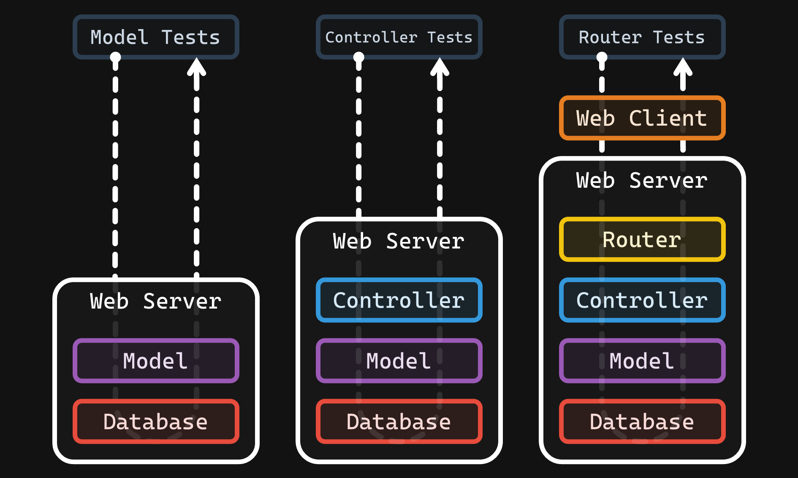

# Assignment 3 - Exceptions ⚠️

- 💯**Worth**: 7.5%
- 📅**Due**: November 1, 2020 @ 23:59
- 🙅🏽‍**Penalty**: Late submissions lose 10% per day to a maximum of 3 days. Nothing is accepted after 3 days and a grade of 0% will be given.

## 🎯 Objectives

- `Throw` exceptions when things in the application go wrong.
- `Catch` exceptions that have been thrown.
- `Log` exceptions to a text file.
- `Present` friendly messages to the user when exceptions occur.

## 📥 Submission

Since we'll be using [Git](https://git-scm.com/) and [GitHub Classroom](https://classroom.github.com/) for this assignment, all you need to do to submit is to commit and push your code to the repository. Over the course of working on the assignment, you should be committing and pushing as you go. I will simply grade the last commit that was made before the assignment deadline.

## 🔨 Setup

1. Attach VSCode to the PHP container. Make sure that inside the container, you're currently in `/var/www/html/Assignments`.
2. Follow the instructions from A1 to clone the repo if you're not sure how.
3. You should now have a folder inside `Assignments` called `assignment-3-githubusername`.
4. Inside of the newly cloned repo, copy all your models, controllers, and router classes from A2 into their respective folder inside `src/`.
5. Change the `base_uri` in `tests/AssignmentThreeTest.php` so that it has your GitHub username in the path.

## 🖋️ Description

In A1, we created the 4 main models (`User`, `Category`, `Post`, and `Comment`) that are in charge of talking to the database. The models are based on the entities from the ERD which can be found in the A1 specs.

In A2, we will implemented the `Router` that handles the web requests/responses and instantiates a `Controller`. We also implemented the `Controller` which takes care of decided which model method to call.

In this assignment, we will focus on the **error-handling** aspect of our application by **throwing and catching exceptions**. If the `Model` throws an `Exception`, it should be caught by the `Controller`, and thrown up to the `Router`. The `Router` will then populate the `Response` message using the error from the `Exception`.

You will find that I have provided the `Exception` classes inside `src/Exceptions`, so there's nothing to do there. You just have to worry about throwing and catching them!

### 🤹‍♀️ Other Stuff

- I changed the database name from `Assignment-1` to `RedditDB` so you may have to make the change on your end accordingly. You can find the SQL script at `src/Database/SetupDB.sql`.
- You'll have to make a `findByUsername()` function for the `User` model. There will be lots of repeated code in your model classes now! Think you can find a way to make it [DRY](https://codinglead.github.io/javascript/what-is-DRY-code)? This won't make an impact as far as the tests are concerned, but it's always a best practice to not repeat yourself!
- In E3.1, I had you throw exceptions for all the `findByX` methods. For simplicity, these methods for the Reddit app can return `null` This means that you'll only have to remove the `?` from the return type for the `create` methods.

## 🧪 Tests

> 💔 When you run the test suite for the first time on your code from A2, **you will get many errors, but please don't freak out!** This is because many of the tests will expect exceptions now instead of empty return values. Run one single test at a time, and if a test has a data provider, run a single data provider at a time, as it will make your life a lot easier while working. If you're unsure of how to do that, refer back to E2.3 and E3.1.

Inside of the `tests` folder you will find the same test files from A2. Inside `tests/ModelTests` and `tests/ControllerTests` I have changed most of the _unhappy path_ tests to check if an exception was thrown instead of the results being `null`/`false`/`empty`. Inside `tests/RouterTests`, the _unhappy paths_ check if the right error message was sent back as well as an empty payload. Here's a recap of the tests from last time:

1. `ModelTests` These tests call methods directly on the models to see if the correct data is being transacted to/from the database.
2. `ControllerTests` are the tests that will invoke methods on the controllers to see if the right models are being called.
3. `RouterTests` will simulate a web client using Guzzle to test if your router is:
   1. Parsing the query string correctly
   2. Calling the correct controller
   3. Sending the correct response back to the client

Just like in A2, you should develop your application in this order. Verify that the models are working from last assignment and make any adjustments as necessary. Then move on to creating the controllers and running the corresponding test suite. Finally, create the router and run the last set of tests to verify that everything is working as it should.

### 🪓 Logging

Finally, as you run the tests, **keep checking to make sure that the exceptions are being written to the log file**. You can run `tail -f -n 1 /var/www/html/php_errors.log` in a VS Code terminal inside the container to have a constant stream of logs to monitor. To have more than one terminal open inside the container, simply click on the `+` in the top right of the terminal panel. You can switch between open terminals using the dropdown menu. You can also have two terminals open at once by clicking the "split" icon which is in between `+` and `🗑️` in the terminal panel.
